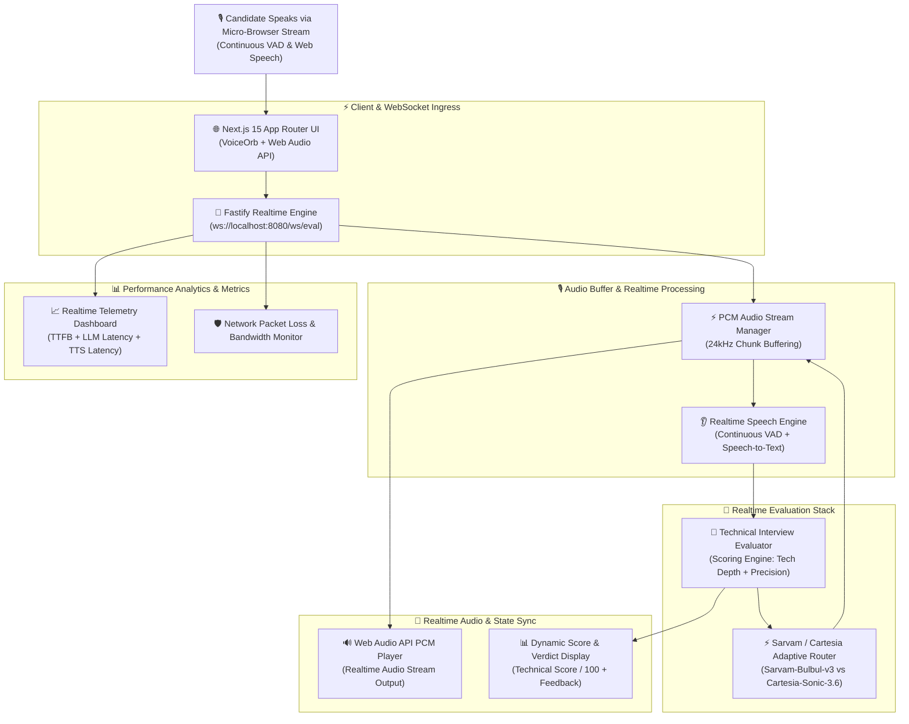

# ✈️ Visa Babu

> **Realtime Voice-First Visa Interview Simulation & Evaluation Engine, powered by Sovereign Indic AI & Sub-Second Audio Streaming.**

Visa Babu is a high-performance, hands-free voice evaluation platform designed to help candidates practice technical visa interviews (F-1, H-1B, O-1) in real-time. Featuring a full-duplex WebSocket architecture, the system listens continuously using Voice Activity Detection (VAD), evaluates technical proficiency, checks answer validity against official criteria, and streams back empathetic, code-mixed audio feedback instantly using low-latency TTS models.

---

## Architecture Diagram



---

## 🎥 Demo Video

Let's see Visa Babu in Action

[(Video Link coming soon upon local sandbox execution completion)](https://www.google.com/search?q=%23)

---

## 📌 Project Overview

Traditional mock interviews require expensive human counselors or static, laggy text prompts. Visa Babu creates a **seamless, hands-free conversational loop** that simulates an actual visa officer:

1. **Continuous Voice Activity Ingestion:** The candidate starts the call session once with a single click. The client monitors audio levels and continuous speech, automatically detecting speech pauses (~1.5s silence) to trigger processing without requiring repetitive button presses.
2. **Sub-Second WebSocket Pipeline:** The transcript is piped over `ws://localhost:8080/ws/eval` to the Fastify Realtime Engine.
3. **Adaptive Evaluation Logic:** The evaluation core parses the candidate's answer for technical specificity, infrastructure architecture details, and clarity. It yields a structured verdict containing a score (`0–100`), tone guidelines, and concise feedback.
4. **Adaptive Voice Engine Routing:** Depending on the candidate's linguistic style, the system dynamically routes speech generation between **Sarvam-Bulbul-v3** (for Indic/code-mixed responses) and **Cartesia-Sonic-3.6** (for fast, high-tech English responses).
5. **PCM Audio Streaming & Auto-Resume:** PCM audio chunks stream back to the browser via Web Audio API. The moment speech playback finishes, the microphone automatically opens back up for the candidate's next answer.

---

## 👩‍💼 Real-World Example: Candidate Answering H-1B Technical Question

> **Visa Officer:** "Can you explain the primary technical contribution you made in your recent software role?"
> **Candidate:** *"Sir, we implemented a distributed Redis cache with LRU eviction ahead of our PostgreSQL database cluster, reducing P99 latency from 450ms to 18ms under peak load."*
> **System Processing:**
> 1. The client auto-detects 1.5 seconds of silence and transmits the audio transcript over WebSockets.
> 2. The system calculates a **Technical Score of 92/100** for strong metrics and clear architectural choices.
> 3. The audio router selects `Sarvam-Bulbul-v3` / `Cartesia` and streams PCM chunks back.
> 4. The candidate hears instant voice feedback while the **Voice Orb** pulses in green (`speaking`).
> 5. As soon as the audio ends, the mic re-activates automatically (`listening`), ready for follow-up questions.
> 
> 

---

## 💭 The Problem Space

Engineering sub-second real-time voice applications presents strict latency and usability constraints:

* **Turn-Taking Friction:** Manual "Click to Speak / Click to Submit" controls ruin the realism of an interview simulation.
* **TTFB (Time to First Byte) Bottlenecks:** Waiting for the full LLM evaluation to finish before generating audio introduces jarring multi-second pauses.
* **Audio Artifacts & Buffer Stalling:** Playing raw PCM streams over WebSockets can cause audio crackling or stuttering if buffer queues aren't synchronized with sample rates (24kHz).
* **Multi-Engine Voice Routing:** Seamlessly switching between regional Indic TTS and high-speed global TTS requires adaptive engine fallbacks without dropping WebSocket connections.

---

## 🧠 Core System Processing Lifecycle

```txt
[User Speaks into Mic] ──► [VAD Silence Detection (1.5s)] ──► [WebSocket Event: submit_transcript]
                                                                        │
                                                            (Fastify Realtime Server)
                                                                        ▼
                                                            [Technical Evaluator Core]
                                                                        │
                                                               ┌────────┴────────┐
                                                               ▼                 ▼
                                                     [Score & Feedback]   [Engine Selection]
                                                               │                 │
                                                               │       (Sarvam vs Cartesia)
                                                               │                 ▼
                                                               │        [TTS PCM Synthesizer]
                                                               │                 │
                                                               └────────┬────────┘
                                                                        ▼
                                                             [Audio Chunk Stream (24kHz)]
                                                                        │
                                                                        ▼
                                                            [Web Audio API PCM Player]
                                                                        │
                                                                        ▼
                                                            [Auto-Resume Listening Loop]

```

---

## 🛠️ Tech Stack & Engineering Rationale

| Architecture Layer | Technology | Engineering Selection Reason |
| --- | --- | --- |
| **Frontend Framework** | **Next.js 15 (App Router)** | High-performance client components for real-time audio playback, visualizer orchestration, and UI updates. |
| **Realtime Gateway** | **Fastify + `ws**` | Ultra-lightweight Node.js WebSocket engine optimized for low-latency streaming audio buffers. |
| **Voice Synthesis** | **Sarvam Bulbul (v3) & Cartesia Sonic 3.6** | Multi-engine voice setup offering low latency and natural code-mixed dialect support. |
| **Client Speech Ingress** | **Web Speech API + VAD** | Browser-native speech recognition integrated with automated silence detection for continuous conversations. |
| **Audio Processing** | **Web Audio API (PCMStreamPlayer)** | Handles raw 24kHz Base64 PCM audio chunk queuing, buffer management, and smooth gapless playback. |
| **Observability** | **Custom Telemetry Matrix** | Measures TTFB (Time-To-First-Byte), LLM evaluation latency, TTS stream duration, and packet loss rates. |

---

## 📋 System State Machine & Session States

* **`IDLE`**: Default state. WebSocket is connected and waiting for call initiation.
* **`LISTENING`**: Microphone is active. Speech activity detection is actively tracking candidate input.
* **`PROCESSING`**: Silence detected (1.5s timeout). Transcript sent to Fastify server; candidate speech paused.
* **`SPEAKING`**: Server streams PCM audio back. `VoiceOrb` pulses visually while the player streams 24kHz audio chunks.
* **`AUTO_RESUME`**: PCM playback completes. Microphone immediately reactivates into `LISTENING` mode without requiring user interaction.

---

## 🚀 Key Engineering Achievements

* **Hands-Free Full-Duplex Audio Loop:** Converted a manual turn-based setup into a seamless voice call experience using silence detection and auto-resuming microphone listeners.
* **Sub-Second Streaming Audio:** Optimized the pipeline to achieve rapid Time-to-First-Byte (TTFB) latencies through chunked Base64 PCM audio streaming.
* **Adaptive Voice Engine Router:** Built multi-engine voice fallback between Sarvam and Cartesia to balance speech naturalness and speed.
* **Real-time Telemetry Dashboard:** Integrated an analytics view tracking LLM vs TTS latency, total frame count, and packet drop simulation.