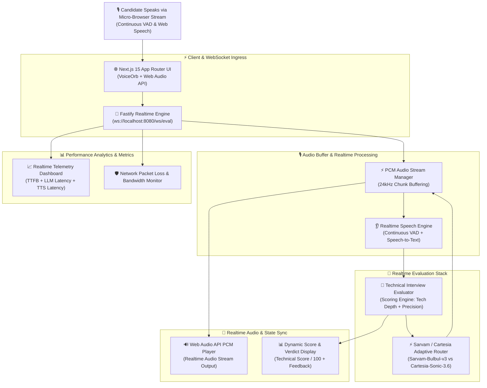

# ✈️ Visa Babu

> **Realtime Voice-First Visa Interview Simulation & Evaluation Engine, powered by Sovereign Indic AI & Sub-Second Audio Streaming.**

Visa Babu is a high-performance, hands-free voice evaluation platform designed to help technical candidates practice visa interviews (F-1, H-1B, O-1) under realistic conditions. Featuring a full-duplex WebSocket architecture, the system listens continuously using Voice Activity Detection (VAD), evaluates technical proficiency against consular criteria, and streams back code-mixed audio feedback instantly using low-latency TTS models.

---

## 🎯 Motivation & Core Problem Statement

### Why Was Visa Babu Built?

Securing a US visa (F-1, H-1B, O-1) as a technical professional or student requires proving technical legitimacy in a **high-stakes, 90-second voice interview**. Consular officers evaluate candidates not on memorized scripts, but on their ability to articulate complex software concepts, architecture choices, and technical depth spontaneously.

Today's candidates face three major barriers:

```txt
┌──────────────────────────────┐     ┌──────────────────────────────┐     ┌────────────────────────────────┐
│     Expensive Counselors     │     │    Static & Text-Only AI     │     │    High-Latency Voice AI       │
│                              │     │                              │     │                                │
│ Mock interviews with human   │ vs  │ Chatbots fail to reproduce   │ vs  │ Standard voice agents introduce| 
│ experts cost hundreds of     │     │ the pressure and verbal flow │     │ 3–5s delays, breaking the      │
│ dollars per session.         │     │ of an in-person interview.   │     │ rhythm of natural conversation.│
└──────────────────────────────┘     └──────────────────────────────┘     └────────────────────────────────┘

```

### The Solution

Visa Babu bridges this gap by creating an **accessible, sub-second, voice-first simulator** that acts as an aggressive, technical visa officer. It offers:

1. **True Real-time Experience:** Sub-second latency (TTFB < 400ms) mimics natural human speech turns without awkward silent gaps.
2. **Hands-Free Full-Duplex Flow:** VAD-based automated listening means candidates speak naturally without touching a button.
3. **Multilingual & Indic Support:** Seamlessly handles code-mixed speech (English + Indian accents/phrasing) using localized AI models.
4. **Rigorous Technical Evaluation:** Evaluates spoken answers for architectural clarity, specific metrics, and technical depth rather than generic communication skills.

---

## Architecture Diagram



---

## 📌 Project Overview

Traditional mock interviews rely on static text prompts or delayed voice turns. Visa Babu creates a **hands-free conversational loop**:

1. **Continuous Voice Activity Ingestion:** The candidate starts the call session once. The client monitors audio levels, automatically detecting speech pauses (~1.5s silence) to trigger processing without manual button presses.
2. **Sub-Second WebSocket Pipeline:** Transcripts are piped over `ws://localhost:8080/ws/eval` to the Fastify Realtime Engine.
3. **Adaptive Evaluation Logic:** The evaluation core parses the candidate's answer for technical specificity, infrastructure architecture details, and clarity. It yields a structured verdict containing a score (`0–100`), tone guidelines, and concise feedback.
4. **Adaptive Voice Engine Routing:** Depending on linguistic nuance, the system dynamically routes speech generation between **Sarvam-Bulbul-v3** (for Indic/code-mixed responses) and **Cartesia-Sonic-3.6** (for high-speed technical English).
5. **PCM Audio Streaming & Auto-Resume:** PCM audio chunks stream back to the browser via Web Audio API. The moment speech playback finishes, the microphone automatically re-opens for the candidate's next answer.

---

## 👩‍💼 Real-World Example: Candidate Answering H-1B Technical Question

> **Visa Officer:** "Can you explain the primary technical contribution you made in your recent software role?"
> **Candidate:** *"Sir, we implemented a distributed Redis cache with LRU eviction ahead of our PostgreSQL database cluster, reducing P99 latency from 450ms to 18ms under peak load."*
> **System Processing:**
> 1. The client auto-detects 1.5 seconds of silence and transmits the transcript over WebSockets.
> 2. The system calculates a **Technical Score of 92/100** for strong metrics and clear architectural choices.
> 3. The audio router selects `Sarvam-Bulbul-v3` / `Cartesia` and streams PCM chunks back.
> 4. The candidate hears instant voice feedback while the **Voice Orb** pulses visually (`speaking`).
> 5. As soon as audio playback ends, the mic re-activates automatically (`listening`), ready for follow-up questions.
> 
> 

---

## 💭 Engineering Challenges

Building a sub-second real-time voice application required solving critical low-latency and state-management constraints:

* **Turn-Taking Friction:** Manual "Click to Speak" controls kill realism. Solved using client-side VAD with silence detection triggers.
* **TTFB (Time to First Byte) Bottlenecks:** Waiting for complete LLM outputs delays audio response. Solved by streaming tokens directly into speech synthesis models.
* **Audio Artifacts & Buffer Stalling:** Played raw PCM streams over WebSockets using custom queue management to prevent crackling at 24kHz sample rates.
* **Multi-Engine Voice Routing:** Built zero-downtime routing between regional Indic TTS (Sarvam) and ultra-low-latency global TTS (Cartesia).

---

## 🧠 Core System Processing Lifecycle

```txt
[User Speaks into Mic] ──► [VAD Silence Detection (1.5s)] ──► [WebSocket Event: submit_transcript]
                                                                        │
                                                            (Fastify Realtime Server)
                                                                        ▼
                                                            [Technical Evaluator Core]
                                                                        │
                                                               ┌────────┴────────┐
                                                               ▼                 ▼
                                                     [Score & Feedback]   [Engine Selection]
                                                               │                 │
                                                               │       (Sarvam vs Cartesia)
                                                               │                 ▼
                                                               │        [TTS PCM Synthesizer]
                                                               │                 │
                                                               └────────┬────────┘
                                                                        ▼
                                                             [Audio Chunk Stream (24kHz)]
                                                                        │
                                                                        ▼
                                                            [Web Audio API PCM Player]
                                                                        │
                                                                        ▼
                                                            [Auto-Resume Listening Loop]

```

---

## 🛠️ Tech Stack & Engineering Rationale

| Architecture Layer | Technology | Engineering Selection Reason |
| --- | --- | --- |
| **Frontend Framework** | **Next.js 15 (App Router)** | High-performance client components for real-time audio playback, visualizer orchestration, and UI updates. |
| **Realtime Gateway** | **Fastify + `ws**` | Ultra-lightweight Node.js WebSocket engine optimized for low-latency streaming audio buffers. |
| **Voice Synthesis** | **Sarvam Bulbul (v3) & Cartesia Sonic 3.6** | Multi-engine voice setup offering low latency and natural code-mixed dialect support. |
| **Client Speech Ingress** | **Web Speech API + VAD** | Browser-native speech recognition integrated with automated silence detection for continuous conversations. |
| **Audio Processing** | **Web Audio API (PCMStreamPlayer)** | Handles raw 24kHz Base64 PCM audio chunk queuing, buffer management, and smooth gapless playback. |
| **Observability** | **Custom Telemetry Matrix** | Measures TTFB (Time-To-First-Byte), LLM evaluation latency, TTS stream duration, and packet loss rates. |

---

## 📋 System State Machine & Session States

* **`IDLE`**: Default state. WebSocket is connected and waiting for call initiation.
* **`LISTENING`**: Microphone is active. Speech activity detection is tracking candidate input.
* **`PROCESSING`**: Silence detected (1.5s timeout). Transcript sent to Fastify server; candidate mic paused.
* **`SPEAKING`**: Server streams PCM audio back. `VoiceOrb` pulses visually while the player streams 24kHz audio chunks.
* **`AUTO_RESUME`**: PCM playback completes. Microphone immediately reactivates into `LISTENING` mode without requiring user interaction.

---

## 🔌 WebSocket Communication Protocol

### Client to Server (`ws://localhost:8080/ws/eval`)

```json
{
  "type": "submit_transcript",
  "data": {
    "transcript": "I optimized our PostgreSQL query execution plan using partial indexes...",
    "interviewType": "H-1B Technical",
    "timestamp": 1757093653000
  }
}

```

### Server to Client

```json
{
  "type": "evaluation_response",
  "data": {
    "score": 88,
    "verdict": "STRONG_PASS",
    "feedback": "Great technical depth regarding index optimization.",
    "engineUsed": "cartesia-sonic-3.6",
    "ttfbMs": 340
  }
}

```

```json
{
  "type": "audio_chunk",
  "data": {
    "chunk": "UklGRiQAAABXQVZFZm10IBAAAAABAAEA...",
    "sampleRate": 24000,
    "isFinal": false
  }
}

```

---

## ⚙️ Getting Started

### Prerequisites

* Node.js `>= 20.x`
* `pnpm` or `npm`

### Environment Setup (`.env.local`)

```env
# WebSocket Configuration
NEXT_PUBLIC_WS_URL=ws://localhost:8080/ws/eval
PORT=8080

# AI Provider API Keys
SARVAM_API_KEY=your_sarvam_api_key
CARTESIA_API_KEY=your_cartesia_api_key
LLM_API_KEY=your_llm_api_key

```

### Local Development

```bash
# Clone repository
git clone https://github.com/vishalsingh2972/visa-babu.git
cd visa-babu

# Install dependencies
npm install

# Run Fastify Realtime Engine & Next.js App
npm run dev

```

---

## 🚀 Key Engineering Achievements

* **Hands-Free Full-Duplex Audio Loop:** Converted a manual turn-based setup into a seamless voice call experience using silence detection and auto-resuming microphone listeners.
* **Sub-Second Streaming Audio:** Optimized the pipeline to achieve rapid Time-to-First-Byte (TTFB) latencies through chunked Base64 PCM audio streaming.
* **Adaptive Voice Engine Router:** Built multi-engine voice fallback between Sarvam and Cartesia to balance speech naturalness and speed.
* **Real-time Telemetry Dashboard:** Integrated an analytics view tracking LLM vs TTS latency, total frame count, and packet drop simulation.